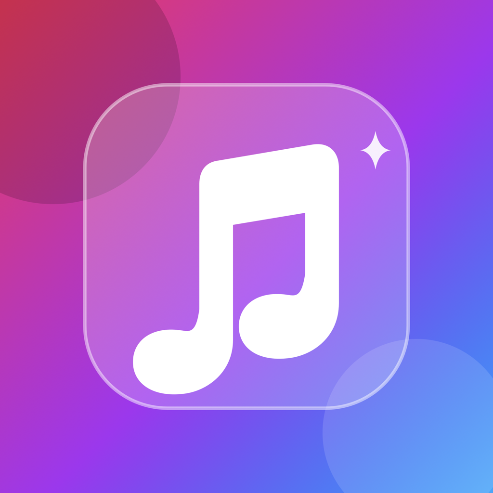

<p align="center">
  
</p>

<h1 align="center">MusicGlass</h1>

<p align="center">
  🇬🇧 <strong>English</strong> | <a href="README.fr.md">🇫🇷 Français</a>
</p>

<p align="center">
  <strong>A premium, native Android music player with a stunning Material Design 3 interface powered by YouTube Music.</strong>
</p>

<p align="center">
  <a href="#-overview">Overview</a> •
  <a href="#-features">Features</a> •
  <a href="#-tech-stack">Tech Stack</a> •
  <a href="#%EF%B8%8F-architecture">Architecture</a> •
  <a href="#-getting-started">Getting Started</a> •
  <a href="#-building">Building</a> •
  <a href="#-roadmap">Roadmap</a>
</p>

---

## ✨ Overview

**MusicGlass** is a modern, high-fidelity music player for **Android**, built with a meticulously crafted interface that bridges YouTube Music's vast catalog with a premium native Android experience.

Powered by a custom **InnerTube** client — the same internal API used by YouTube Music — MusicGlass delivers a rich, fast, and visually stunning listening experience. Every interaction, from browsing the home feed to immersive full-screen playback, is designed with fluid animations and Material Design 3 at its core.

> **Disclaimer:** This is a third-party prototype. It is not affiliated with, endorsed by, or associated with YouTube, Google, or their affiliates. No DRM circumvention is included.

---

## 🚀 Features

### 🎨 Premium User Interface
- **Material Design 3** with dynamic color support (Android 12+ Monet theming).
- **Liquid Glass-inspired effects** with custom blur and transparency layers.
- **Edge-to-edge rendering** with seamless status bar and navigation bar transparency.
- **Smooth micro-animations** — screen transitions, player expand/collapse, scrolling top bar.
- **Adaptive layouts** — responsive full player, elegant mini-player, and interactive drag-to-reorder queue.
- **Light / Dark / System theme modes** with persistent preferences.

### 🎧 Advanced Audio Playback
- **ExoPlayer / Media3** engine for reliable, high-performance audio streaming.
- **Native media notification** with album art, title, artist, and full transport controls.
- **Foreground service** (`mediaPlayback`) for reliable background audio.
- **System media controls** — lock screen, notification panel, Bluetooth, Android Auto-ready.
- **Smart queue management** — shuffle, repeat (one/all), dynamic track insertion, gapless-like transitions.
- **LRU audio cache** (256 MB) with automatic eviction and preloading of the next track.
- **Network resilience** — survives network drops, reconnection, and expired stream URLs transparently.

### 🔍 Discovery & Library (InnerTube API)
- **Personalized home feed** powered by YouTube Music's `FEmusic_home` endpoint.
- **Ultra-fast search** with 350 ms debounce and grouped results: Songs, Albums, Artists, Playlists, Videos.
- **Search suggestions** with autocomplete via the `get_search_suggestions` endpoint.
- **Library sections** — Liked Songs, User Playlists, Listening History (authenticated).
- **Artwork enrichment** — intelligent artwork matching and fallback via YouTube Music's search API, with concurrent fetching (6 parallel permits).

### 🎤 Immersive Lyrics Integration
- **LRCLib** open-source lyrics database integration.
- **Real-time synchronized lyrics** with line-by-line highlighting.
- **Plain text fallback** when synced lyrics are unavailable.
- **Language detection** and display.

### 🔄 Over-the-Air Updates
- **GitHub Releases integration** — automatic update checking at startup.
- **Download progress tracking** with a visual progress indicator.
- **APK installation** triggered directly via `FileProvider`.
- **Changelog display** when a new version is installed.
- **Dismissable update prompts** with per-version tracking.

---

## 🛠️ Tech Stack

| Category | Technology | Version |
|---|---|---|
| **Language** | Kotlin | 2.2.10 |
| **UI Framework** | Jetpack Compose | BOM 2023.10.01 |
| **Design System** | Material Design 3 | Compose BOM |
| **Audio Engine** | Media3 / ExoPlayer | 1.2.0 |
| **Media Session** | Media3 Session | 1.2.0 |
| **HTTP Client** | OkHttp | 4.12.0 |
| **JSON Parsing** | kotlinx.serialization + org.json | 1.6.2 |
| **Image Loading** | Coil | 2.5.0 |
| **Concurrency** | Kotlin Coroutines | 1.7.3 |
| **State Management** | StateFlow + ViewModel | 2.6.2 |
| **Navigation** | Navigation Compose | 2.7.5 |
| **Build System** | Gradle (Kotlin DSL) | 9.1.1 |
| **Min SDK** | Android 8.0 (API 26) | — |
| **Target/Compile SDK** | Android 14 (API 34) | — |

---

## 🏗️ Architecture

MusicGlass follows a **modular, single-module MVVM architecture** with clean separation of concerns:

```
app/src/main/java/com/musicglass/app/
├── App.kt                         # Application class + Coil ImageLoader setup
├── MainActivity.kt                # Single-Activity entry point
│
├── core/
│   └── update/                    # Self-update system
│       ├── UpdateModels.kt        # GitHub Release DTOs
│       ├── UpdateRepository.kt    # Update check + APK download + install
│       ├── UpdateViewModel.kt     # Changelog & update dialog logic
│       └── UpdateDialogs.kt       # Compose dialogs
│
├── ui/
│   ├── MainScreen.kt              # Root navigation (Home, Search, Library, Settings)
│   ├── theme/
│   │   └── Theme.kt               # Material 3 theming + Dynamic Color + Dark/Light
│   ├── features/
│   │   ├── HomeScreen.kt          # Home feed + greeting header
│   │   ├── HomeViewModel.kt       # Home feed state
│   │   ├── SearchScreen.kt        # Search with suggestions + results
│   │   ├── LibraryScreen.kt       # Liked songs, playlists, history tabs
│   │   ├── PlaylistScreen.kt      # Playlist detail view
│   │   ├── PlaylistViewModel.kt   # Playlist state + queue management
│   │   ├── MediaDetailScreens.kt  # Album/Artist detail pages
│   │   ├── SettingsScreen.kt      # Theme, audio quality, debug, updates
│   │   ├── LoginWebViewScreen.kt  # OAuth-style login via WebView
│   │   ├── TrackActionsMenu.kt    # Long-press context menu
│   │   ├── auth/
│   │   │   └── AccountAuthScreen.kt
│   │   ├── library/
│   │   │   └── artists/
│   │   │       └── ArtistsScreen.kt
│   │   └── profile/
│   │       └── ProfileBottomSheet.kt
│   └── player/
│       ├── FullPlayerScreen.kt    # Immersive full-screen player
│       ├── LyricsScreen.kt        # Synced lyrics display
│       └── QueueScreen.kt         # Drag-to-reorder queue
│
├── playback/
│   ├── MusicGlassPlaybackController.kt   # ExoPlayer wrapper + queue management
│   ├── MusicGlassMediaSessionService.kt  # Media3 foreground service
│   ├── MusicGlassPlaybackCache.kt        # LRU audio cache (SimpleCache)
│   ├── MusicGlassBitmapLoader.kt         # Custom bitmap loader for Media3
│   ├── NetworkConnectivityObserver.kt    # Real-time network monitoring
│   └── PlayerViewModel.kt               # Player state
│
├── youtubemusic/
│   ├── InnerTubeClient.kt         # Multi-client InnerTube API (WEB_REMIX, ANDROID_VR, TV_EMBEDDED)
│   ├── InnerTubeDTO.kt            # Serializable request/response DTOs
│   ├── InnerTubeJSONMapper.kt     # Defensive JSON → domain model mapping
│   ├── MusicMetadataSanitizer.kt  # Metadata normalization + deduplication
│   ├── ArtworkEnricher.kt         # Concurrent artwork search + matching engine
│   ├── AuthService.kt             # SAPISID-based auth + cookie persistence
│   └── LyricsService.kt           # LRCLib lyrics integration
│
└── persistence/
    ├── AppSettingsRepository.kt   # Theme, audio quality, debug preferences
    ├── LibraryRepository.kt       # In-memory library cache
    └── PlaybackHistoryRepository.kt # Local playback history with search
```

### Key Design Decisions

#### Multi-Client InnerTube Strategy
The core innovation of MusicGlass is its custom **InnerTube** client, which emulates three different YouTube clients to maximize compatibility:

| Client | Used For | Key Benefit |
|---|---|---|
| `WEB_REMIX` (client 67) | Browse, Search, Home, Next, Lyrics | Full catalog access, recommendations |
| `ANDROID_VR` (client 28) | Player / audio stream URL | Direct audio URLs **without** signature deciphering |
| `TV_EMBEDDED` (client 85) | Fallback player | Works for content requiring authentication |

The `ANDROID_VR` client is particularly critical — it returns deciphered audio URLs directly, avoiding the complex n-parameter signature cipher that plagues other YouTube clients.

#### Authentication (SAPISID-based)
- Cookie-based authentication via `SAPISID` / `__Secure-3PAPISID`.
- Custom `Authorization` header generation using SHA-1 HMAC.
- Persistent storage via `SharedPreferences` with optional WebView login flow.

#### Artwork Enrichment Pipeline
Many YouTube Music API responses lack high-quality artwork. MusicGlass solves this with a **concurrent artwork enrichment pipeline**:
1. For each track without artwork, perform a filtered YouTube Music search.
2. Match results using fuzzy title stemming + artist token matching.
3. Fall back through weak matches (artist → title stem).
4. Cache successful matches in a `ConcurrentHashMap` for instant reuse.

#### Playback Resilience
- `NetworkConnectivityObserver` monitors real-time network state via `ConnectivityManager`.
- Transparent retry on network loss with `retryOnConnectionFailure`.
- LRU cache (`SimpleCache`) with 256 MB ceiling, least-recently-used eviction.
- Preloading of the next track during playback.
- Cross-protocol redirect support for resilient stream URL resolution.

---

## 📦 Getting Started

### Prerequisites
- **Android Studio** Hedgehog (2023.1.1) or later
- **JDK 17**
- **Android SDK 34** with build tools
- An Android device or emulator running **Android 8.0 (API 26)** or higher

### Clone & Build

```bash
# Clone the repository
git clone https://github.com/jeremy99981/MusicGlass-Android.git
cd MusicGlass-Android

# Build the debug APK
./gradlew assembleDebug

# Or install directly to a connected device
./gradlew installDebug
```

### Signing

Release builds use a flexible signing configuration:

1. Create `keystore.properties` at the project root:
   ```properties
   storeFile=/path/to/your.keystore
   storePassword=yourStorePassword
   keyAlias=yourKeyAlias
   keyPassword=yourKeyPassword
   ```

2. Or set environment variables: `RELEASE_STORE_FILE`, `RELEASE_STORE_PASSWORD`, `RELEASE_KEY_ALIAS`, `RELEASE_KEY_PASSWORD`.

3. Without either, the debug keystore is used as a fallback.

```bash
./gradlew assembleRelease
```

---

## 🔧 Building for Production

```bash
# Build the release APK
./gradlew assembleRelease

# The APK will be at:
# app/build/outputs/apk/release/MusicGlass-{versionName}.apk
```

> **Note:** The APK output name is automatically set to `MusicGlass-{versionName}.apk` based on `defaultConfig.versionName` in `build.gradle.kts`.

---

## 🛣️ Roadmap

- [ ] **Full OAuth Authentication** — Secure YouTube/Google sign-in with token refresh.
- [ ] **Library Sync** — Remote synchronization of liked songs, albums, artists, and playlists.
- [ ] **Offline Mode** — Audio file caching for true offline playback with download management.
- [ ] **Advanced Lyrics** — Karaoke-style word-by-word highlighting and translation overlay.
- [ ] **Equalizer** — System-wide equalizer integration via `AudioEffect`.
- [ ] **Android Auto** — Full Android Auto media browsing and playback support.
- [ ] **Wear OS** — Companion app for smartwatch controls.
- [ ] **Widgets** — Home screen widgets (now playing, quick actions, favorites).
- [ ] **Social Features** — Last.fm scrobbling.
- [ ] **Multi-language** — Full localization (FR, ES, DE, JA, etc.).

---

## 🤝 Contributing

Contributions, bug reports, and feature requests are welcome!

1. Fork the repository
2. Create your feature branch (`git checkout -b feature/AmazingFeature`)
3. Commit your changes (`git commit -m 'Add some AmazingFeature'`)
4. Push to the branch (`git push origin feature/AmazingFeature`)
5. Open a Pull Request

---

## 📄 License

This project is a third-party prototype. See the [main MusicGlass repository](https://github.com/jeremy99981/MusicGlass) for licensing information.

---

<p align="center">
  <i>Crafted with ❤️ for music lovers and Android developers.</i>
</p>
